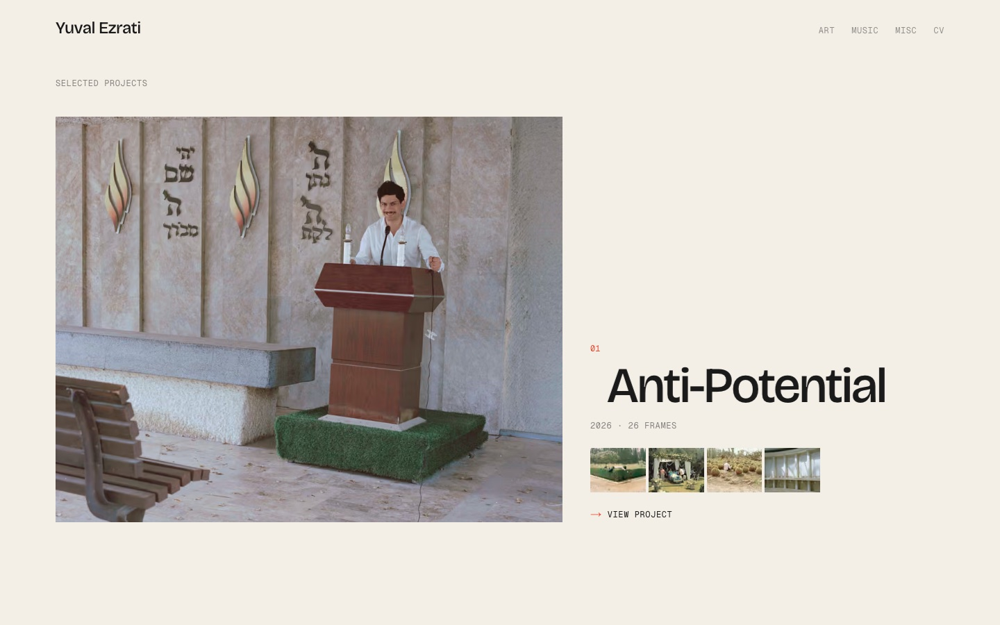
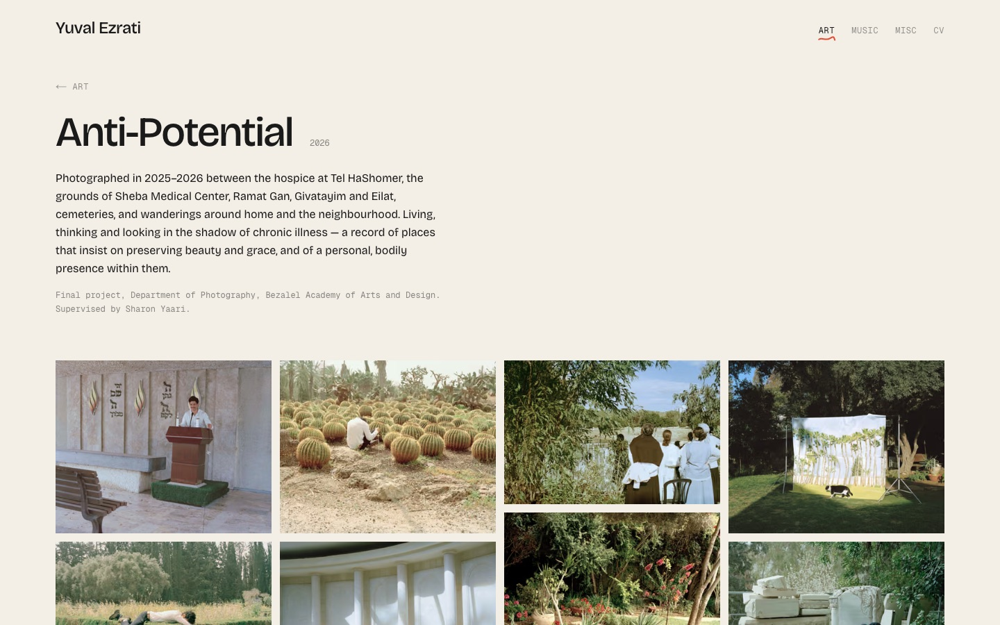
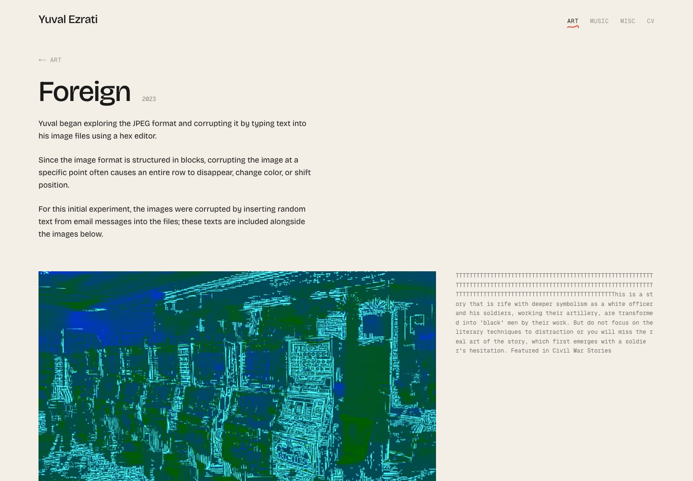
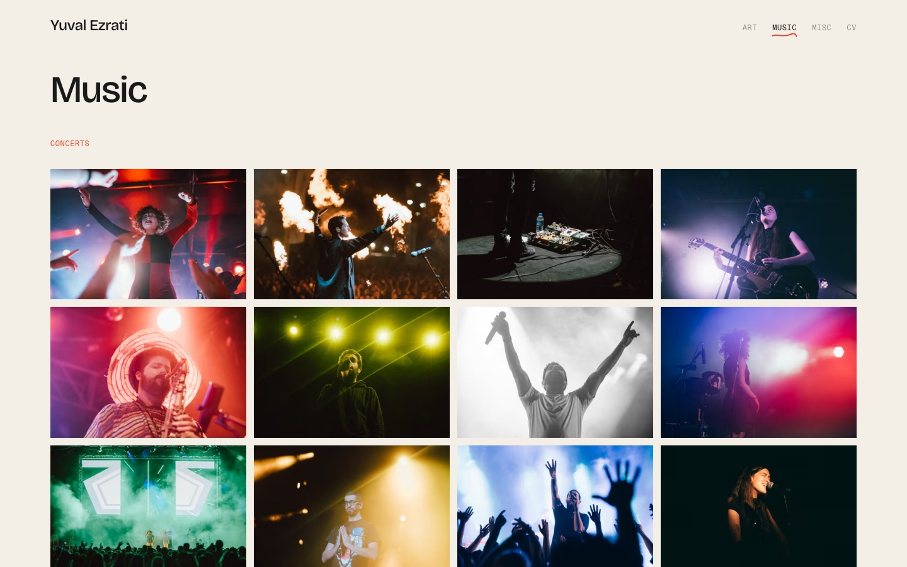
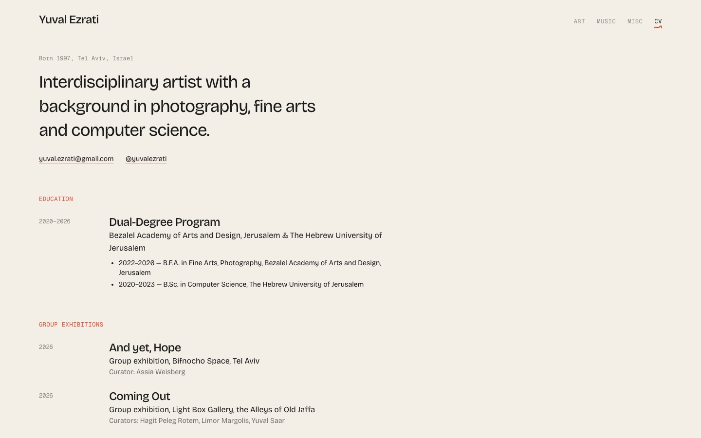
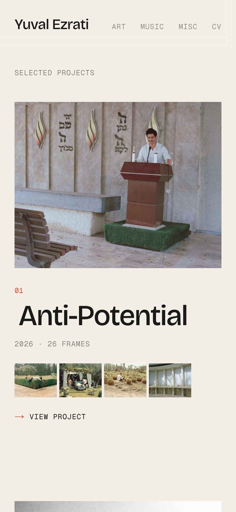
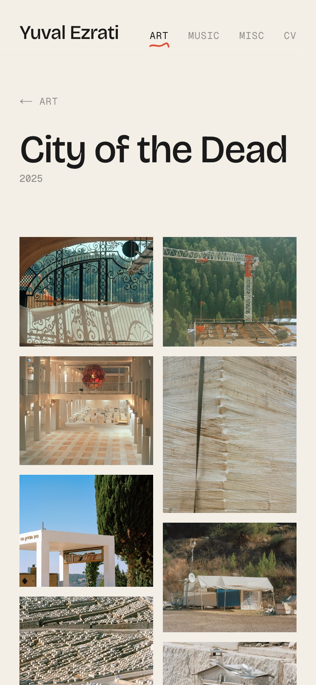

# Yuval Ezrati — Photography Portfolio

The portfolio site of Yuval Ezrati, an interdisciplinary artist working across photography,
fine art and computer science.

**Live:** [yuval-ezrati.vercel.app](https://yuval-ezrati.vercel.app)



| Art project | Corrupted-JPEG experiment (Foreign) |
| --- | --- |
|  |  |
| **Music** | **CV** |
|  |  |

<p>
  
  
</p>

## What's on the site

- **Art** — projects (*Anti-Potential*, *Sde Dov*, *City of the Dead*, *Foreign*), each a statement
  followed by image grids, with extra sections such as Installation, Book or Video.
- **Music** — concerts, then a section per musician.
- **Misc** — other work.
- **CV** — education, exhibitions and experience.

Design notes:

- Minimal and gallery-first: warm paper background, Bricolage Grotesque for text, Geist Mono for
  small labels, one red accent. All text aligns to the start of the line (left in English).
- Photos "develop" as they load, open full screen (morphing out of the grid) with arrows,
  keyboard and swipe, and the header slides away while scrolling down.
- *Foreign* serves its deliberately corrupted JPEGs byte for byte (never re-encoded), plays
  frame sequences in place and shows the text that was typed into each file.
- A Hebrew (right-to-left) version is built in but currently switched off — see
  [Languages](#languages).

## Tech

- [Next.js 16](https://nextjs.org) (App Router, static pages) and React 19
- [Tailwind CSS 4](https://tailwindcss.com)
- `next/image` for responsive AVIF/WebP photos
- Hosted on [Vercel](https://vercel.com)

```
src/
  app/[lang]/       pages (home, art, art/[project], music, misc, cv), layout, 404
  components/       Gallery, Lightbox, RunningSequence, ProjectShowcase, SiteHeader, …
  lib/content.ts    projects, photos, alt text, captions
  lib/i18n.ts       interface text (English, Hebrew)
  proxy.ts          serves English at the root (and redirects /he while Hebrew is off)
public/photos/      web copies of the photos and videos
docs/screenshots/   the images in this README
```

`CLAUDE.md` holds the design rules for the project.

## Running it locally

Requires Node.js 20.9 or newer.

```bash
npm install
npm run dev
```

Then open [localhost:3000](http://localhost:3000). `npm run build` makes a production build;
`npm run lint` checks the code.

### Preview on your phone

With the dev server running and the phone on the same Wi-Fi as this computer, open
`http://<computer-name>.local:3000` (e.g. `http://yuvals-macbook-pro.local:3000`) or the
"Network" address that `npm run dev` prints. `next.config.ts` allows this computer's network
addresses automatically.

## Adding photos

Full-resolution masters stay in `images/` (git-ignored and never uploaded). The site serves
web copies from `public/photos/`:

1. Export web copies: sRGB, at most 2560px on the long edge, upright (rotate any photo that
   relies on an EXIF orientation tag), e.g.
   `sips -m "/System/Library/ColorSync/Profiles/sRGB Profile.icc" -Z 2560 -s formatOptions 88 in.jpg --out public/photos/art/sde-dov/01.jpg`
2. Add them in `src/lib/content.ts`: their pixel size in `photoSizes`, then the photo set with
   alt text for each image.
3. When a folder gains or loses photos, name its web copies after the originals (e.g.
   `dsc-0452.jpg`) rather than renumbering them — otherwise an old address would point at a
   different photo, and browsers keep showing the cached old one.

Deliberately corrupted files (as in *Foreign*) are copied as they are and marked
`unoptimized`, so the image optimizer never re-encodes them.

Art projects live in the `artProjects` array; each `slug` becomes `/art/<slug>`. A project is a
list of `sections` (the work, Installation, Book, Video…), shown one after another as image
grids, running sequences or videos.

## Languages

English is served at `/`. A Hebrew (right-to-left) version at `/he` is built in but switched
off for now: add `"he"` to `enabledLocales` in `src/lib/i18n.ts` and restore the header's
language link to bring it back; meanwhile `/he` links redirect to the English page.
`src/proxy.ts` maps root URLs onto `app/[lang]` with `lang = "en"`, so both languages share
the same pages. Interface text is in `src/lib/i18n.ts`; each project's Hebrew title and
statement go in its `he` field in `src/lib/content.ts`, and the CV's Hebrew text is in
`src/app/[lang]/cv/page.tsx`.

## Deploying

The site is deployed to Vercel with the CLI (installed as a dev dependency):

```bash
npx vercel deploy --prod
```

`.vercelignore` keeps the `images/` masters out of uploads.

## Rights

All photographs, videos and texts © Yuval Ezrati. All rights reserved. They may not be
reused without permission.
